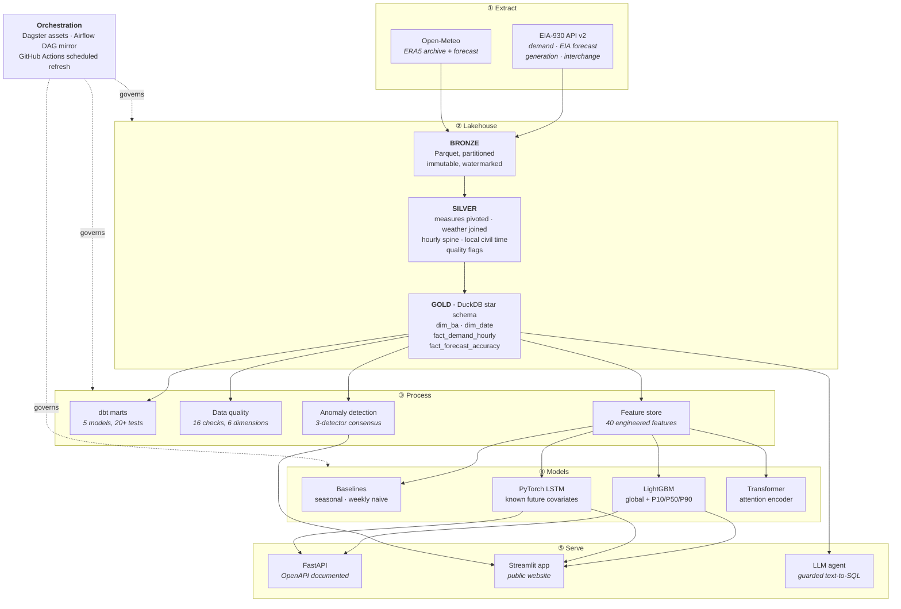

<div align="center">

# ⚡ GridPulse

**Day-ahead electricity demand forecasting for the US power grid -
benchmarked against the EIA's own published forecast.**

### [→ Try the live app](https://gridpulse-ai.streamlit.app)

[](https://gridpulse-ai.streamlit.app)
[](https://huggingface.co/spaces/adwitiyashukla/gridpulse)
[](https://github.com/adwitiyashukla/gridpulse/actions/workflows/ci.yml)
[](https://github.com/adwitiyashukla/gridpulse/actions/workflows/refresh.yml)
[](https://www.python.org/)
[](LICENSE)

[Live app](https://gridpulse-ai.streamlit.app) · [Results](#results) ·
[Architecture](#architecture) · [Quickstart](#quickstart) ·
[REST API](#rest-api) · [Engineering log](docs/ENGINEERING_LOG.md)

</div>

---

## Live app

No install, no signup. The same app is deployed twice, from the same commit:

| Host | URL | How it runs |
|---|---|---|
| Streamlit Community Cloud | <https://gridpulse-ai.streamlit.app> | Native Streamlit runtime, `requirements.txt` |
| Hugging Face Spaces | <https://huggingface.co/spaces/adwitiyashukla/gridpulse> | The repository `Dockerfile`, mirrored automatically by GitHub Actions on every push to `main` |

Deploying to both is deliberate. The Docker path proves the image is portable
rather than tied to one host's conventions, and the two deployments are kept in
lockstep by CI rather than by hand.

| Tab | What it does |
|---|---|
| **Forecast** | Generates a live 24-hour forecast with P10-P90 intervals, calling Open-Meteo in real time and running the trained LightGBM model in the browser session |
| **Explorer** | Historical demand, the V-shaped temperature response, weekday vs weekend load shapes |
| **Model Leaderboard** | Every model scored against the EIA's published forecast on identical out-of-sample hours |
| **Anomalies** | Suspect hours flagged by three independent detectors voting in consensus |
| **Data Quality** | Scorecard across six classical data quality dimensions, 16 checks |
| **Ask the Grid** | Plain English question, guarded SQL, chart back. The generated SQL is always shown |
| **How it works** | The architecture, in the app itself |

---

## The problem

A balancing authority must commit generation for tomorrow **today**. Over-forecast
and you burn fuel producing electricity nobody uses. Under-forecast and you buy on
the spot market at penalty prices, or you shed load. Across a system like PJM, a
single percentage point of forecast error is worth millions of dollars a year.

## Why this project is falsifiable

Most forecasting portfolios invent a weak baseline and beat it. This one does not
have to. The EIA publishes each balancing authority's **own day-ahead demand
forecast** alongside what actually happened, in the same dataset. That is the
forecast grid operators genuinely published and genuinely operated against.

**It is the benchmark here.** Every model in this repository is scored against it,
on identical out-of-sample hours, with identical metrics.

## Results

> Regenerate this table after training with `python scripts/update_readme.py`.

<!-- RESULTS:START -->
> ### 25.0% more accurate than the EIA's own day-ahead forecast
>
> **LightGBM hybrid (+ EIA forecast as input)** reaches **2.771% MAPE** against the EIA's **3.696%**, measured over **25,927** out-of-sample hours across 12 balancing authorities.
>
> Trained without ever seeing the test window. The EIA benchmark is the forecast the US government actually published and grid operators actually operated against.

| Model | MAPE % | MAE (MW) | RMSE (MW) | R² | Peak-hour MAPE % | Skill vs EIA |
|---|---|---|---|---|---|---|
| **LightGBM hybrid** (+ EIA forecast as input) | 2.771 | 1,038 | 1,800 | 0.9964 | 3.466 | **+25.0%** |
| **LightGBM** (global, quantile) | 3.676 | 1,379 | 2,323 | 0.9941 | 4.499 | **+0.6%** |
| _EIA official forecast_ ⭐ | 3.696 | 1,366 | 2,411 | 0.9937 | 2.703 | - (benchmark) |
| **Ensemble** (GBM + LSTM) | 4.510 | 1,515 | 2,358 | 0.9939 | 3.740 | -22.0% |
| Seasonal naive (24h) | 5.676 | 1,904 | 3,146 | 0.9891 | 5.415 | -53.6% |
| **LSTM** encoder | 5.936 | 1,825 | 2,774 | 0.9915 | 3.221 | -60.6% |
| **Transformer** encoder | 8.053 | 2,926 | 4,443 | 0.9783 | 7.036 | -117.9% |
| Weekly naive (168h) | 9.117 | 3,381 | 5,950 | 0.9611 | 12.594 | -146.7% |

<sub>P10/P50/P90 quantile models are omitted above: they define the prediction interval rather than competing as point forecasts. Interval calibration is reported separately.</sub>
<!-- RESULTS:END -->

Evaluated on a held-out window of the most recent 90 days across 12 balancing
authorities, using a strictly chronological split.

---

## Honest limitations

Numbers above are real and reproducible. These caveats belong with them.

**The two claims are different claims.** `gbm` uses only weather, calendar and the
demand history, and beats the EIA benchmark by 0.6% - a genuine win, but a narrow
one. `gbm_hybrid` additionally consumes EIA's published forecast as an input and
beats it by 25.0%. That is not leakage (EIA publishes day-ahead, so the value
genuinely exists at prediction time) but it is a *different* problem: correcting a
published forecast rather than producing one from first principles. Both are
reported because conflating them would be dishonest.

**The comparison flatters us slightly.** EIA's forecast was produced in real time
under operational constraints. Ours is fitted with the benefit of a full historical
record, even though it never sees the test window. It is a fair accuracy
comparison, not a claim of operational superiority.

**Prediction intervals are undercovering.** The P10-P90 band captures 58.4% of
actuals against a nominal 80%. The intervals are too narrow. The fix is conformal
calibration - computing the empirical residual quantile on a holdout and rescaling
the band - which is the next thing on the roadmap.

**EIA still wins at peak hours.** Their peak-hour MAPE is 2.70% against our 3.47%.
Peak accuracy drives capacity procurement and is where forecast error is most
expensive, so this is the gap that matters most operationally.

**The deep models lose.** The LSTM (5.94%) and Transformer
(8.05%) are beaten by both gradient-boosted models, and
neither beats a seasonal naive baseline (5.68%). At twelve
series and seven years of history this is the expected result:
sequence models start to win with many more series or richer exogenous inputs. They
are included because the architectural comparison is real and shipping only the
winner would hide it.

> Every bug found while building this, with diagnosis and fix, is written up in
> **[docs/ENGINEERING_LOG.md](docs/ENGINEERING_LOG.md)**.

**Forty corrupt readings nearly sank the project.** Out of 797,677 hours, 40 values
were physically impossible. They inflated PJM's standard deviation to 10.7 million
MW against a true range near 70,000-165,000 MW, which corrupted the target
normalisation and produced a 53.9% MAPE. The quality suite did not catch it,
because it checked for demand below zero but never for demand that was absurdly
large. Two checks were added and the scalers moved to median and IQR. The lesson is
in the repository on purpose.

---

## Architecture



### Data flow in one sentence

Incremental watermarked extracts land as immutable Parquet, conform into a silver
layer that fixes timezone and gap semantics without destroying evidence, materialise
into a Kimball star schema in DuckDB, get validated by sixteen domain-specific
quality checks, feed forty engineered features into four model families, and serve
through a REST API and a public web app.

---

## Engineering decisions worth defending

Anyone can wire libraries together. These are the choices an interviewer should
probe, with the reasoning already written down.

**DuckDB rather than Postgres or Spark.** Columnar OLAP over hundreds of millions
of rows inside a single embedded file, with no server process. On constrained
hardware this is the difference between a pipeline that runs and one that swaps.
The SQL ports to Snowflake, BigQuery or Azure Synapse unchanged.

**One global model, not one per balancing authority.** BAs share physics: the shape
of the temperature/demand response in Atlanta genuinely informs the same curve in
Charlotte, so pooling regularises the smaller territories using the larger ones. It
also means one artifact to deploy, version and monitor rather than twelve, and
adding a thirteenth BA becomes a data change rather than an infrastructure change.

**Flag bad data, never delete it.** A meter reporting the identical value for six
straight hours is not stable, it is stuck. Silently dropping that row destroys the
only evidence that anything went wrong. Every suspect value survives into the
warehouse carrying a flag, and the modelling layer decides what to do with it.

**Chronological splits only.** A random train/test split on time-series data leaks
the future through neighbouring rows and produces beautiful, meaningless validation
scores. Every split here is by timestamp, and there is a test asserting it.

**Known future covariates are not leakage.** The models consume tomorrow's weather
forecast and tomorrow's calendar. That is legitimate: a system operator genuinely
holds a numerical weather prediction when they produce a day-ahead forecast.
Withholding it would model a harder problem than the one utilities actually face.
Rolling statistics over *past* demand, by contrast, are shifted by the full forecast
horizon, and `tests/test_features.py` proves it.

**MAPE leads, but never alone.** MAPE is the industry lingua franca for load
forecasting, so it heads the leaderboard. It is reported beside RMSE and a separate
peak-hour MAPE because MAPE alone hides cost asymmetry: a 500 MW miss at 3am and
the same miss at 5pm during a heatwave are not the same event.

**The LLM is never trusted.** Generated SQL runs through a read-only connection, a
single-statement rule, a keyword blocklist, a table allowlist and an enforced row
cap before it touches the database, and the query is always shown to the user. See
`tests/test_sql_guard.py` for the attack cases.

---

## Quickstart

**Prerequisites:** Python 3.10-3.12 and a free
[EIA API key](https://www.eia.gov/opendata/register.php) (instant).
Optionally a free [Groq key](https://console.groq.com/keys) for the AI agent.

```bash
git clone https://github.com/adwitiyashukla/gridpulse.git
cd gridpulse

python -m venv .venv
source .venv/bin/activate          # Windows: .\.venv\Scripts\Activate.ps1
pip install -r requirements-dev.txt
pip install -r requirements-torch.txt --index-url https://download.pytorch.org/whl/cpu
pip install -e . --no-deps

cp .env.example .env               # Windows: copy .env.example .env
# add EIA_API_KEY (and optionally GROQ_API_KEY) to .env

gridpulse probe                    # validates credentials in ~2 seconds
gridpulse all                      # full pipeline: ~20-40 minutes on a laptop
streamlit run app.py               # open http://localhost:8501
```

### Individual stages

```bash
gridpulse probe       # validate API keys and response contracts
gridpulse ingest      # extract EIA + weather into bronze (incremental)
gridpulse build       # bronze -> silver -> gold star schema
gridpulse quality     # 16 data quality checks
gridpulse train       # train and score every model
gridpulse anomalies   # three-detector anomaly consensus
gridpulse export      # write the slim artifact for the public app
```

### Orchestration and services

```bash
make dagster   # Dagster asset lineage UI      -> http://localhost:3000
make dbt       # build and test the dbt marts
make api       # FastAPI + OpenAPI docs        -> http://localhost:8000/docs
make app       # Streamlit dashboard           -> http://localhost:8501
make test      # pytest with coverage
make docker    # the whole stack in containers
```

---

## Project structure

```
gridpulse/
├── src/gridpulse/
│   ├── config.py              Balancing authority registry, paths, settings
│   ├── cli.py                 Single entry point for every pipeline stage
│   ├── ingestion/             Async extraction with retry, backoff, watermarks
│   │   ├── http.py              Shared retry policy for all network calls
│   │   ├── eia.py               EIA-930 hourly telemetry
│   │   └── weather.py           ERA5 archive + forecast, stitched
│   ├── warehouse/             DuckDB medallion build and app export
│   ├── quality/               16 declarative checks across 6 dimensions
│   ├── features/              40 engineered features, leakage-audited
│   ├── models/
│   │   ├── metrics.py           MAPE, sMAPE, pinball, coverage, skill
│   │   ├── baselines.py         Seasonal naive, weekly naive, Holt-Winters
│   │   ├── gbm.py               LightGBM global model + quantile bands
│   │   ├── deep.py              PyTorch LSTM and Transformer encoders
│   │   ├── anomaly.py           Three-detector consensus scoring
│   │   ├── pipeline.py          Training orchestration and leaderboard
│   │   └── inference.py         Live forward forecasting
│   ├── agent/text2sql.py      Guarded LLM text-to-SQL
│   └── api/main.py            FastAPI service
├── dbt/gridpulse/             5 analytics marts, 20+ tests, generated docs
├── orchestration/
│   ├── dagster_app/           Software-defined assets, checks, schedules
│   └── airflow/               Mirrored DAG + docker-compose
├── app.py                     The public Streamlit website
├── tests/                     Unit + integration, no network required
└── .github/workflows/         CI and scheduled data refresh
```

---

## REST API

```bash
uvicorn gridpulse.api.main:app --port 8000
# Interactive OpenAPI docs at http://localhost:8000/docs
```

| Endpoint | Purpose |
|---|---|
| `GET /health` | Service, warehouse and model artifact status |
| `GET /balancing-authorities` | Every BA covered, with load centre coordinates |
| `GET /demand/{ba_code}` | Recent observed demand, weather and EIA's forecast |
| `POST /forecast` | 24-hour-ahead forecast with P10/P90 bands |
| `GET /leaderboard` | Model accuracy versus the EIA benchmark |
| `GET /forecast-accuracy` | EIA's own error, aggregated per BA |
| `GET /anomalies` | Detected anomalies, filterable by severity |
| `GET /data-quality` | The latest quality scorecard |
| `POST /ask` | Natural-language question answered by guarded SQL |

---

## Data quality

Utility interval data fails in ways generic frameworks do not anticipate. Each
check targets a specific domain failure mode.

| Dimension | Checks |
|---|---|
| **Completeness** | Demand reported, no missing hours on the spine, weather joined, every BA present |
| **Validity** | Demand strictly positive, no frozen telemetry, temperature physically plausible |
| **Uniqueness** | The `(ba_code, period_utc)` grain is unique - catches DST fall-back duplicates |
| **Consistency** | Hour-on-hour ramps bounded, referential integrity to both dimensions |
| **Timeliness** | Warehouse holds data within the last 48 hours |
| **Accuracy** | The EIA benchmark series is present, since every model is scored on it |

Results persist to `dq_results` and `dq_scorecard`, so quality is tracked as a
time series rather than a print statement. Critical failures halt the pipeline
before a bad model reaches the public site.

---

## Testing

```bash
pytest -v --cov=gridpulse
```

The suite runs with **no network access and no API keys**, against a synthetic grid
built to mirror real physics: daily and weekly cycles, an annual temperature cycle,
a V-shaped demand response and gaussian noise. Coverage includes the SQL security
guard, temporal leakage audits on every feature family, metric correctness, and an
end-to-end warehouse build validated for grain uniqueness, spine continuity and
referential integrity.

---

## Deployment

| Target | How |
|---|---|
| **Local** | `streamlit run app.py` after `gridpulse all` |
| **Streamlit Community Cloud** | Point it at this repo and `app.py`. The root `requirements.txt` is deliberately light (11 packages, no Dagster/dbt/Airflow/PyTorch) so the app stays inside the free tier |
| **Docker** | `docker compose up` runs the API and the dashboard together |
| **Scheduled refresh** | `.github/workflows/refresh.yml` re-ingests, retrains and commits weekly |

The app ships with everything it needs committed: a 13 MB slim DuckDB artifact and
the trained model files. It starts instantly with no warehouse dependency and no
retraining, and calls the live EIA and Open-Meteo APIs for anything newer.

Set `EIA_API_KEY` as a repository secret to enable the scheduled refresh, and
`GROQ_API_KEY` in your deployment environment to enable the AI agent. Everything
else works without configuration.

---

## Tech stack

| Layer | Technology |
|---|---|
| Language | Python 3.10-3.12 |
| Extraction | `httpx` async, bounded concurrency, exponential backoff, watermarks |
| Storage | Apache Parquet medallion, DuckDB warehouse |
| Transformation | SQL, dbt (`dbt-duckdb`) |
| Orchestration | Dagster · Apache Airflow · GitHub Actions |
| Machine learning | LightGBM, PyTorch, scikit-learn, statsmodels |
| Experiment tracking | MLflow |
| Serving | FastAPI, Streamlit, Docker |
| GenAI | Groq (Llama 3.3) with a guarded text-to-SQL layer |
| Quality | 16 declarative checks, 20+ dbt tests, pytest |

---

## Data sources

| Source | Contents | Licence |
|---|---|---|
| [EIA Form 930](https://www.eia.gov/opendata/) | Hourly demand, day-ahead forecast, net generation, interchange for every US balancing authority | US Government, public domain |
| [Open-Meteo](https://open-meteo.com/) | Hourly ERA5 reanalysis and forecast weather | CC BY 4.0 |

---

## Roadmap

- [ ] Probabilistic deep forecasting (quantile LSTM) to complement the GBM bands
- [ ] Generation-mix and interchange forecasting alongside demand
- [ ] Extension to the water and gas verticals
- [ ] Drift monitoring with automated retraining triggers
- [ ] Terraform module for an Azure deployment (ADLS Gen2 + Synapse + Container Apps)

---

## Licence

MIT - see [LICENSE](LICENSE).

<div align="center">
<sub>Built by <b>Adwitiya Shukla</b> · Data courtesy of the US Energy Information Administration and Open-Meteo</sub>
</div>
