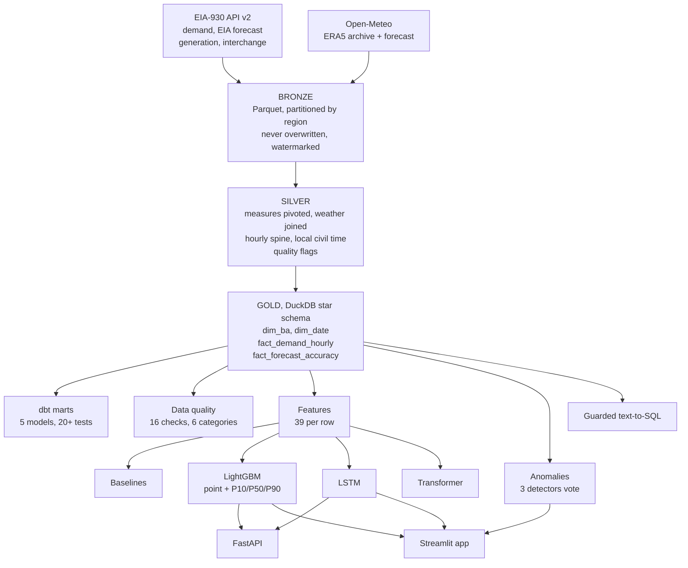

# GridPulse

A day-ahead electricity demand forecaster for 12 US grid regions, scored against
the forecast the US Energy Information Administration actually published for the
same hours.

[](https://github.com/adwitiyashukla/gridpulse/actions/workflows/ci.yml)
[](https://github.com/adwitiyashukla/gridpulse/actions/workflows/refresh.yml)
[](https://www.python.org/)
[](LICENSE)

Live: [Hugging Face](https://huggingface.co/spaces/adwitiyashukla/gridpulse)
or [Streamlit Cloud](https://gridpulse-ai.streamlit.app). Both run off the same commit.

## Where the data comes from

Two public sources, no synthetic data anywhere in the results.

| Source | What I take from it |
|---|---|
| EIA Form 930 (API v2) | Hourly demand, the EIA's own day-ahead forecast, net generation, interchange |
| Open-Meteo | Hourly weather for each region's biggest city, ERA5 archive joined to the forecast endpoint |

Weather comes from the load centre rather than the geographic centre of a region,
because demand follows the weather where people actually live. ERCOT is pulled at
Houston, not somewhere in west Texas.

The archive lags about five days behind, so I stitch it to the forecast endpoint
to cover the gap and to get tomorrow's weather. Where both cover the same hour the
archive wins, since it is the measured value.

## The pipeline



Bronze files are never rewritten, only appended to, and each region stores a
watermark so a rerun picks up where the last one stopped instead of downloading
seven years again. Silver is where the timezone work happens. Gold is the star
schema everything downstream reads.

## Getting the time axis right

This is the part that took the longest and has nothing to do with machine learning.

Grid data is reported in UTC, but electricity demand follows local human behaviour.
People in Los Angeles switch things on at 7am Pacific regardless of what UTC says.
So every row carries both: stored in UTC, with local civil time derived from the
region's timezone for anything hour-of-day related.

That creates two problems that only show up twice a year. When clocks go back there
are two 1am hours locally, which turns into a duplicate row if you key on local time.
When they go forward there is no 2am at all, which looks like missing data. Keying
on UTC and deriving local time from it makes both disappear.

The other thing I did was build a continuous hourly spine per region between the
first and last observation, then left join the readings onto it. If a region simply
did not report for six hours, I want a row saying so rather than a silent gap that a
lag feature would step straight over. There is a test that walks the spine and fails
if any two consecutive hours are more than an hour apart.

That test taught me something. It first reported 12 gaps in a series I knew was
continuous, because I had written it with `date_diff('hour', ...)`, which DuckDB
resolves using the session timezone and counts daylight saving transitions as
missing hours. Measuring the difference in epoch seconds instead fixed it. The test
was wrong, not the data, and I nearly changed the data to match.

## The features, and keeping the future out of them

39 features per row: cyclical encodings of hour, day of week and day of year,
holiday and weekend flags, lags of demand at 24, 25, 26, 48, 72, 168 and 336 hours,
rolling mean and standard deviation over 24 and 168 hours, the raw weather columns,
heating and cooling degrees split around an 18C balance point, and a few interaction
terms.

The rule I held to is that a feature for hour t can only use information that
existed at t minus 24 hours. Every rolling statistic is shifted by the full forecast
horizon before the window is taken. Every train, validation and test split is by
timestamp, never random, because shuffling a time series puts future rows next to
past ones and the score stops meaning anything.

Weather and the calendar are the exception, and I think that is fair. A real grid
operator planning tomorrow already has tomorrow's weather forecast and knows it is a
Tuesday. Hiding that would be solving a harder problem than the one utilities have.
`tests/test_features.py` rebuilds the expected lag and rolling windows from the raw
data and checks the built features match.

The model agrees about what matters. Cooling degrees interacted with hour of day
carries the most gain, then the 24 hour rolling mean of temperature, then the region
code, then temperature squared. Yesterday's demand at the same hour is fifth. Air
conditioning load, basically.

## One model for twelve regions

I train a single LightGBM model across all 12 regions with the region code as a
categorical feature, rather than 12 separate models.

The regions behave alike. How demand responds to temperature in Atlanta genuinely
tells you something about the same curve in Charlotte, so training together lets the
larger regions help the smaller ones. It also means one model file to version and
deploy instead of twelve, and adding a thirteenth region becomes more data rather
than more infrastructure.

The catch is scale. PJM peaks near 165,000 MW and TVA sits around 18,000 MW, so an
unscaled loss would let PJM dominate training completely. Each region's target is
normalised by its own median and interquartile range before training and inverted
afterwards. I use median and IQR rather than mean and standard deviation because a single
absurd reading can drag a mean and a standard deviation anywhere, and 40 bad
readings in this dataset once did exactly that.

I also train a second variant that takes the EIA's published forecast as an input
feature. It is the strongest model in the table, and it is solving an easier problem:
correcting somebody else's forecast rather than producing one from scratch. I report
both because showing only the better one would be misleading.

## What the numbers say

<!-- RESULTS:START -->
LightGBM hybrid (+ EIA forecast as input) gets 2.877% MAPE where the EIA's own published forecast gets 3.655%, which is 21.3% better, measured on 25,918 test hours from 2026-05-17 onwards across 12 balancing authorities.

| Model | MAPE % | MAE (MW) | RMSE (MW) | R2 | Peak-hour MAPE % | Hours scored | Skill vs EIA |
|---|---|---|---|---|---|---|---|
| **LightGBM hybrid** (+ EIA forecast as input) | 2.877 | 1,136 | 2,002 | 0.9959 | 3.435 | 25,918 | **+21.3%** |
| **LightGBM** (global, quantile) | 3.644 | 1,430 | 2,372 | 0.9943 | 4.657 | 25,918 | **+0.3%** |
| _EIA official forecast_ | 3.655 | 1,405 | 2,487 | 0.9938 | 2.848 | 25,342 | - (benchmark) |
| **Ensemble** (GBM + LSTM) | 4.490 | 1,694 | 2,688 | 0.9927 | 3.622 | 25,918 | -22.9% |
| Seasonal naive (24h) | 5.572 | 1,942 | 3,206 | 0.9896 | 5.271 | 25,918 | -52.5% |
| **LSTM** encoder | 5.874 | 2,136 | 3,481 | 0.9877 | 2.997 | 25,914 | -60.7% |
| **Transformer** encoder | 8.328 | 3,301 | 4,913 | 0.9755 | 6.073 | 25,914 | -127.8% |
| Weekly naive (168h) | 9.460 | 3,566 | 6,072 | 0.9625 | 13.093 | 25,918 | -158.8% |

The P10, P50 and P90 rows are left out of this table. They draw the prediction interval rather than competing as point forecasts.
<!-- RESULTS:END -->

Some things those numbers do not say.

The prediction interval is too narrow. The P10 to P90 band should contain 80% of
actual values and contains 58.34%. The model is more confident than it has earned.
Conformal calibration on held-out residuals is the fix and I have not done it yet.

The EIA is still better than me at peak hours, 2.848% against my 3.435%. Peak hours
are exactly where a miss costs the most, because that is when generation gets bought
at short notice, so this is the gap that matters most and I am losing it.

The EIA row is scored on 25,342 hours where every other row has 25,918. That is not
a mistake in the table. Their published forecast is missing for a few hundred hours,
and I score each model only on hours where that model produced a prediction, rather
than filling gaps with something invented.

The comparison also flatters me. The EIA produced their forecast live, on a deadline,
with whatever data existed at the time. Mine is trained on years of history and only
withheld from the test window. It is a fair accuracy comparison and it is not proof
my model would hold up in real operations.

The deep models lost. Both the LSTM and the Transformer come in behind a seasonal
naive baseline. With 12 series and a few years of data that is roughly what the
literature would predict, and gradient boosting on good features is simply the right
tool at this size. I kept them in because comparing the approaches was the point.

## Making it run without me

The pipeline is written as Dagster assets with the dependency graph declared rather
than implied by the order I call things, plus asset checks that assert the fact table
is populated and the benchmark is present.

Three GitHub Actions workflows keep it going without me touching anything.

| Workflow | When | What it does |
|---|---|---|
| `ci.yml` | every push and PR | lint, tests on Python 3.10, 3.11 and 3.12, dbt project parses, Dagster assets load |
| `refresh.yml` | Mondays 07:00 UTC | re-ingest, rebuild, validate, retrain, rebuild this results table, commit |
| `sync-huggingface.yml` | every push to main | mirror the repo to the Space, which rebuilds the Docker image |
| `keepalive.yml` | every 6 hours | ping the Space so it never hits the 48 hour idle timeout |

The keepalive one exists because a free Space sleeps after 48 hours without traffic,
and the next visitor then waits about a minute on a loading screen. It polls the Hub
API for `runtime.stage` rather than just curling the app, because a sleeping Space
serves a holding page while its container boots and a plain HTTP 200 check would pass
on that holding page.

There is also a REST API, mostly so the forecasts are usable by something other than
my own dashboard.

| Endpoint | Returns |
|---|---|
| `GET /health` | whether the warehouse and model files are actually there |
| `GET /balancing-authorities` | the 12 regions with coordinates and timezones |
| `GET /demand/{ba_code}` | recent demand, weather and the EIA forecast for one region |
| `POST /forecast` | a 24 hour forecast with P10 and P90 bands |
| `GET /leaderboard` | the model scores |
| `GET /forecast-accuracy` | the EIA's own error broken down per region |
| `GET /anomalies` | flagged hours, filterable by severity |
| `GET /data-quality` | the latest quality scorecard |
| `POST /ask` | a natural language question answered through the guarded SQL agent |

## Running it

You need Python 3.10 to 3.12 and a free EIA API key. A free Groq key is optional and
only turns on the natural language tab.

```
git clone https://github.com/adwitiyashukla/gridpulse.git
cd gridpulse

python -m venv .venv
.venv\Scripts\activate
pip install -r requirements-dev.txt
pip install -r requirements-torch.txt --index-url https://download.pytorch.org/whl/cpu
pip install -e . --no-deps

copy .env.example .env
gridpulse probe
gridpulse all
streamlit run app.py
```

On macOS or Linux use `source .venv/bin/activate` and `cp` instead of `copy`.

`gridpulse all` takes roughly 20 to 40 minutes, most of it downloading. Individual
stages:

```
gridpulse probe       check the API key and that the response looks how I expect
gridpulse ingest      pull EIA and weather into the bronze layer
gridpulse build       bronze to silver to the gold star schema
gridpulse quality     run the 16 checks
gridpulse train       train and score every model
gridpulse anomalies   run the three anomaly detectors
gridpulse export      write the slim database the app ships with
```

The app and the tests need none of that. The app database and the trained models are
committed, so `streamlit run app.py` works on a fresh clone with nothing configured,
and `pytest` needs no internet and no keys at all.

```
make dagster   asset lineage UI on port 3000
make dbt       build and test the dbt marts
make api       FastAPI with OpenAPI docs on port 8000
make docker    API and dashboard in containers
```

## What is in the repo

```
gridpulse/
  src/gridpulse/
    config.py        the 12 regions, their timezones and load centres, paths, settings
    cli.py           one entry point for every pipeline stage
    ingestion/       EIA and Open-Meteo download, async, resumable, retry rules in one place
    warehouse/       bronze to silver to gold in DuckDB, plus the slim app export
    quality/         16 checks across 6 categories, results saved to the warehouse
    features/        the 39 features and the chronological split
    models/          metrics, baselines, LightGBM, LSTM, Transformer, anomaly detectors
    agent/           natural language to SQL, behind six guards
    api/             FastAPI service with OpenAPI docs
  dbt/gridpulse/     5 marts and 20+ dbt tests on top of the gold layer
  orchestration/     Dagster assets, checks and schedules
  app.py             the Streamlit dashboard
  tests/             137 tests, no network required
  .github/workflows/ CI, the weekly refresh, the Space sync, the keepalive ping
```

## Tests

```
pytest -v --cov=gridpulse
```

137 tests. The ones I would read first:

| Test | What it pins down |
|---|---|
| `test_features.py::test_rolling_features_do_not_leak_the_present` | Rolling statistics are shifted by the full 24 hour horizon |
| `test_features.py::test_lag_features_reference_the_correct_past_value` | `demand_lag_24h` at time t really is demand at t minus 24h |
| `test_warehouse.py::test_hourly_spine_is_continuous` | No missing hours, measured in epoch seconds so DST cannot fake a gap |
| `test_warehouse.py::test_grain_is_unique` | One row per region per hour, which catches the DST fall back duplicate |
| `test_sql_guard.py::test_stacked_statement_is_refused` | The SQL guard blocks two statements chained with a semicolon |
| `test_sql_guard.py::test_comment_hidden_payload_is_neutralised` | A DELETE hidden behind a SQL comment never reaches the database |
| `test_metrics.py::test_non_finite_and_nonpositive_values_are_excluded` | The reported sample size matches the rows the metrics were computed on |

That last one exists because of a bug. My evaluation function counted every valid
number when reporting how many observations it used, but computed the metrics only on
rows that were valid and above zero. Every metric was describing a smaller set than
the number printed beside it. The test caught it and the test was right.

## The natural language tab

There is a tab where you can ask a question in English and get SQL and a chart back.
An LLM writes the SQL, which means I do not trust it. Before anything runs it has to
pass a read-only connection, a single statement rule, a SELECT or WITH only rule, a
banned keyword list applied after comments are stripped out, a list of allowed tables
that blocks the system catalogue, and a row limit. The app always shows you the query
it generated, because an answer you cannot check is an answer you should not trust.
`tests/test_sql_guard.py` holds the attacks I tried against it, including stacking two
statements and hiding a DELETE behind a comment.

## Anomaly detection

Three detectors have to agree before an hour is called unusual: a median absolute
deviation z-score computed within region, hour of day and month cells, an Isolation
Forest over demand, ramp rate and temperature sensitivity, and a small autoencoder
trained on daily load shapes normalised by each day's own median. Severity rises with
the number of detectors that agree. Over 800,445 scored hours it flags 21,165, which
is 2.644%, and only 45 of those are high severity.

Flagged readings are kept in the warehouse rather than deleted. A meter reporting the
same value for six hours straight is not steady, it is stuck, and dropping that row
destroys the only evidence the meter broke. The modelling step decides separately what
to exclude.

## Licence

MIT, see [LICENSE](LICENSE).
