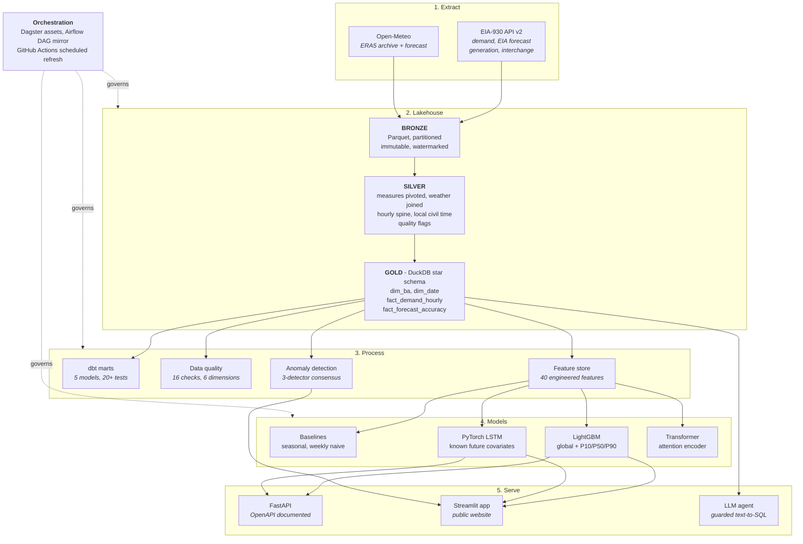

<div align="center">

# GridPulse

**Day-ahead electricity demand forecasting for the US power grid -
benchmarked against the EIA's own published forecast.**

[](https://huggingface.co/spaces/adwitiyashukla/gridpulse)
[](https://gridpulse-ai.streamlit.app)
[](https://github.com/adwitiyashukla/gridpulse/actions/workflows/ci.yml)
[](https://github.com/adwitiyashukla/gridpulse/actions/workflows/refresh.yml)
[](https://www.python.org/)
[](LICENSE)

</div>

Live app: [Hugging Face](https://huggingface.co/spaces/adwitiyashukla/gridpulse) (Docker)
or [Streamlit Cloud](https://gridpulse-ai.streamlit.app), both deployed from the same commit.

---

## Results

<!-- RESULTS:START -->
> ### 24.1% more accurate than the EIA's own day-ahead forecast
>
> **LightGBM hybrid (+ EIA forecast as input)** reaches **2.797% MAPE** against the EIA's **3.686%**, measured over **25,925** out-of-sample hours across 12 balancing authorities.
>
> The model never sees the test window during training, and the EIA benchmark is the forecast the US government actually published.

| Model | MAPE % | MAE (MW) | RMSE (MW) | R2 | Peak-hour MAPE % | Skill vs EIA |
|---|---|---|---|---|---|---|
| **LightGBM hybrid** (+ EIA forecast as input) | 2.797 | 1,068 | 1,826 | 0.9964 | 3.483 | **+24.1%** |
| **LightGBM** (global, quantile) | 3.683 | 1,395 | 2,330 | 0.9942 | 4.626 | **+0.1%** |
| _EIA official forecast_ | 3.686 | 1,383 | 2,442 | 0.9936 | 2.885 | - (benchmark) |
| **Ensemble** (GBM + LSTM) | 4.670 | 1,659 | 2,598 | 0.9928 | 3.760 | -26.7% |
| Seasonal naive (24h) | 5.657 | 1,922 | 3,179 | 0.9892 | 5.273 | -53.5% |
| **LSTM** encoder | 6.191 | 2,093 | 3,311 | 0.9882 | 3.171 | -68.0% |
| **Transformer** encoder | 6.577 | 2,425 | 3,632 | 0.9859 | 5.284 | -78.4% |
| Weekly naive (168h) | 9.328 | 3,480 | 6,032 | 0.9610 | 12.734 | -153.1% |

<sub>P10/P50/P90 quantile models are omitted above: they define the prediction interval rather than competing as point forecasts. Interval calibration is reported separately.</sub>
<!-- RESULTS:END -->

Tested on the most recent 90 days across 12 balancing authorities, split by date so
the model never sees the test window. The benchmark is the EIA's own day-ahead
forecast, which comes in the same dataset as the actual values.

**Limitations**

- The P10-P90 band should contain 80% of actual values but only contains 58%, so the model is more confident than it should be. The fix is conformal calibration.
- The EIA is still better at peak hours (2.885% against 3.483%), and peak hours are where being wrong costs the most.
- `gbm_hybrid` gets the EIA forecast as an input feature, so it has an easier job than `gbm`, which only uses weather, the calendar and past demand.
- The LSTM and the Transformer both lose to a simple seasonal baseline. With 12 series and a few years of data that is what you would expect.

---

## Architecture



Anything built from past demand is shifted back by the full 24 hours, and every split
is by date rather than random. `tests/test_features.py` checks both.

---

## Quickstart

Python 3.10-3.12 and a free [EIA API key](https://www.eia.gov/opendata/register.php).
A free [Groq key](https://console.groq.com/keys) is optional and enables the SQL agent.

```bash
git clone https://github.com/adwitiyashukla/gridpulse.git
cd gridpulse

python -m venv .venv
source .venv/bin/activate
pip install -r requirements-dev.txt
pip install -r requirements-torch.txt --index-url https://download.pytorch.org/whl/cpu
pip install -e . --no-deps

cp .env.example .env

gridpulse probe
gridpulse all
streamlit run app.py
```

### Stages

```bash
gridpulse probe       # validate API credentials and response contracts
gridpulse ingest      # EIA + weather into the bronze layer
gridpulse build       # bronze -> silver -> gold star schema
gridpulse quality     # 16 data quality checks
gridpulse train       # train and score every model
gridpulse anomalies   # three-detector anomaly consensus
gridpulse export      # slim DuckDB artifact for the app
```

```bash
make dagster   # asset lineage UI on :3000
make dbt       # build and test the dbt marts
make api       # FastAPI + OpenAPI docs on :8000
make app       # Streamlit dashboard on :8501
make test      # pytest with coverage
make docker    # API and dashboard in containers
```

---

## Project structure

```
gridpulse/
├── src/gridpulse/
│   ├── config.py              Balancing authority registry, paths, settings
│   ├── cli.py                 Entry point for every pipeline stage
│   ├── ingestion/             EIA-930 and Open-Meteo extraction, async with retries
│   ├── warehouse/             DuckDB layers and the app export
│   ├── quality/               16 data quality checks across 6 dimensions
│   ├── features/              40 features, leakage-tested
│   ├── models/                metrics, baselines, LightGBM, LSTM, Transformer, anomalies
│   ├── agent/text2sql.py      Guarded LLM text-to-SQL
│   └── api/main.py            FastAPI service
├── dbt/gridpulse/             5 dbt models, 20+ tests
├── orchestration/             Dagster assets and an Airflow DAG mirror
├── app.py                     Streamlit dashboard
├── tests/                     Offline test suite
└── .github/workflows/         CI and the weekly data refresh
```

---

## REST API

```bash
uvicorn gridpulse.api.main:app --port 8000
```

| Endpoint | Returns |
|---|---|
| `GET /health` | Service, warehouse and model artifact status |
| `GET /balancing-authorities` | The 12 regions covered, with coordinates |
| `GET /demand/{ba_code}` | Recent demand, weather and the EIA forecast for one region |
| `POST /forecast` | 24-hour forecast with P10/P90 bands |
| `GET /leaderboard` | Model accuracy against the EIA benchmark |
| `GET /forecast-accuracy` | EIA forecast error per region |
| `GET /anomalies` | Flagged hours, filterable by severity |
| `GET /data-quality` | Latest quality scorecard |
| `POST /ask` | Natural-language question answered via guarded SQL |

The SQL agent has six checks before anything runs: a read-only connection, one
statement only, SELECT or WITH only, a banned keyword list, a list of allowed tables
and a row limit. The app always shows the SQL it wrote.
`tests/test_sql_guard.py` has the attacks I tested it against.

---

## Data quality

| Dimension | Checks |
|---|---|
| Completeness | Demand reported, no missing hours, weather joined, all 12 regions present |
| Validity | Demand positive, magnitude within 0.2x-5x the regional median, dispersion sane, meter not frozen, temperature physically possible |
| Uniqueness | One row per region per hour, catching the DST fall-back duplicate |
| Consistency | Hour-on-hour ramp within bounds, referential integrity to `dim_ba` and `dim_date` |
| Timeliness | Warehouse holds data from the last 48 hours |
| Accuracy | The EIA benchmark forecast is present |

Results are saved to `dq_results` and `dq_scorecard` so I can look back at how quality
changed over time. If a critical check fails the pipeline stops, so a broken model
never reaches the live site.

---

## Testing

```bash
pytest -v --cov=gridpulse
```

140 tests, and they need no internet and no API keys. The fixtures build a fake grid
with a daily cycle, a weekly cycle, a yearly temperature cycle and the V-shaped link
between temperature and demand, then build a real DuckDB warehouse from it.

---

## Deployment

| Target | How |
|---|---|
| Local | `streamlit run app.py` after `gridpulse all` |
| Hugging Face Spaces | Repository `Dockerfile` on port 7860, mirrored by `sync-huggingface.yml` on every push to `main` |
| Streamlit Community Cloud | Points at this repo and `app.py`. `requirements.txt` is 11 packages, no Dagster, dbt, Airflow or PyTorch |
| Docker | `docker compose up` runs the API and dashboard together |
| Weekly refresh | `refresh.yml` re-ingests, rebuilds, validates, retrains and commits every Monday |

The app database and the trained models are committed, so the deployed app starts
straight away without building a warehouse or training anything.

---

## Tech stack

| Layer | Technology |
|---|---|
| Language | Python 3.10-3.12 |
| Extraction | `httpx` async, paginated, watermarked |
| Storage | Parquet bronze/silver/gold, DuckDB warehouse |
| Transformation | SQL and dbt (`dbt-duckdb`) |
| Orchestration | Dagster, Apache Airflow, GitHub Actions |
| Modelling | LightGBM, PyTorch, scikit-learn, statsmodels |
| Tracking | MLflow |
| Serving | FastAPI, Streamlit, Docker |
| Agent | Groq (Llama 3.3) with SQL guardrails |

---

## Data sources

| Source | Provides | Licence |
|---|---|---|
| [EIA Form 930](https://www.eia.gov/opendata/) | Hourly demand, day-ahead forecast, net generation, interchange | US Government, public domain |
| [Open-Meteo](https://open-meteo.com/) | Hourly ERA5 archive and forecast weather | CC BY 4.0 |

---

## Licence

MIT, see [LICENSE](LICENSE).
