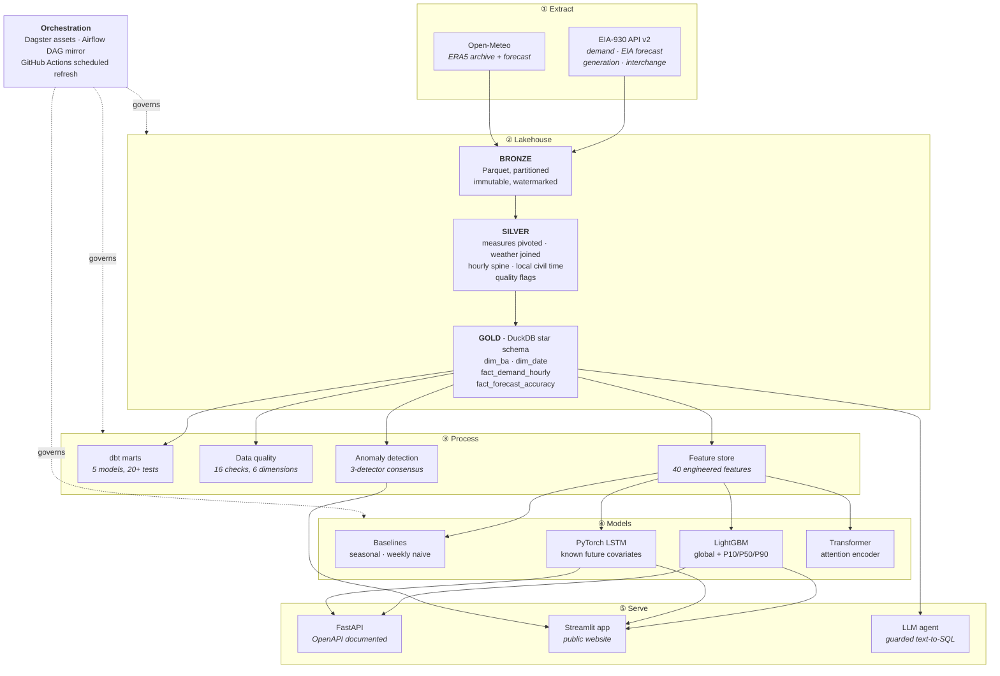

<div align="center">

# ⚡ GridPulse

**Day-ahead electricity demand forecasting for the US power grid -
benchmarked against the EIA's own published forecast.**

### Try it live: [Hugging Face](https://huggingface.co/spaces/adwitiyashukla/gridpulse) or [Streamlit](https://gridpulse-ai.streamlit.app)

[](https://huggingface.co/spaces/adwitiyashukla/gridpulse)
[](https://gridpulse-ai.streamlit.app)
[](https://github.com/adwitiyashukla/gridpulse/actions/workflows/ci.yml)
[](https://github.com/adwitiyashukla/gridpulse/actions/workflows/refresh.yml)
[](https://www.python.org/)
[](LICENSE)

[Live app](#live-app) · [Results](#results) · [Architecture](#architecture) ·
[Quickstart](#quickstart) · [REST API](#rest-api) ·
[Engineering log](docs/ENGINEERING_LOG.md)

</div>

---

## Live app

No install, no signup. The same app is deployed twice, from the same commit:

| Host | URL | How it runs |
|---|---|---|
| Hugging Face Spaces | <https://huggingface.co/spaces/adwitiyashukla/gridpulse> | The repository `Dockerfile`, mirrored automatically by GitHub Actions on every push to `main` |
| Streamlit Community Cloud | <https://gridpulse-ai.streamlit.app> | Native Streamlit runtime, `requirements.txt` |

Deploying to both is on purpose. The Docker version shows the app runs anywhere,
not just on one host that happens to support Streamlit, and GitHub Actions keeps
the two copies in step so I never have to update them by hand.

| Tab | What it does |
|---|---|
| Forecast | Makes a live 24-hour forecast with a P10-P90 range. It fetches the weather forecast right then and runs the trained LightGBM model |
| Explorer | Past demand, the V-shaped link between temperature and demand, and how weekdays differ from weekends |
| Model Leaderboard | Every model scored against EIA's published forecast on exactly the same test hours |
| Anomalies | Hours that look wrong, found by three different detectors that have to agree |
| Data Quality | A scorecard covering 16 checks across six categories |
| Ask the Grid | Ask a question in normal English, get SQL and a chart back. It always shows you the SQL it wrote |
| How it works | An explanation of the whole pipeline, inside the app |

---

## The problem

Electricity cannot really be stored at grid scale, so the companies that run the
grid have to decide today how much power to generate tomorrow. If they guess too
high, they burn fuel making electricity nobody uses. If they guess too low, they
have to buy the shortfall at emergency prices, or cut power to customers. On a
grid the size of PJM, being off by one percent costs millions of dollars a year.
That is why the forecast matters.

## Why the results can be checked

A lot of forecasting projects make up an easy baseline and then beat it. This one
does not need to. The EIA publishes each balancing authority's own day-ahead
forecast next to what actually happened, in the same dataset. That is the forecast
grid operators really published and really used to run the grid.

That is the baseline I compare against. Every model here is scored on the same
test hours with the same metrics, so anyone can check whether the numbers hold up.

## Results

> Regenerate this table after training with `python scripts/update_readme.py`.

<!-- RESULTS:START -->
> ### 24.1% more accurate than the EIA's own day-ahead forecast
>
> **LightGBM hybrid (+ EIA forecast as input)** reaches **2.797% MAPE** against the EIA's **3.686%**, measured over **25,925** out-of-sample hours across 12 balancing authorities.
>
> Trained without ever seeing the test window. The EIA benchmark is the forecast the US government actually published and grid operators actually operated against.

| Model | MAPE % | MAE (MW) | RMSE (MW) | R² | Peak-hour MAPE % | Skill vs EIA |
|---|---|---|---|---|---|---|
| **LightGBM hybrid** (+ EIA forecast as input) | 2.797 | 1,068 | 1,826 | 0.9964 | 3.483 | **+24.1%** |
| **LightGBM** (global, quantile) | 3.683 | 1,395 | 2,330 | 0.9942 | 4.626 | **+0.1%** |
| _EIA official forecast_ ⭐ | 3.686 | 1,383 | 2,442 | 0.9936 | 2.885 | - (benchmark) |
| **Ensemble** (GBM + LSTM) | 4.670 | 1,659 | 2,598 | 0.9928 | 3.760 | -26.7% |
| Seasonal naive (24h) | 5.657 | 1,922 | 3,179 | 0.9892 | 5.273 | -53.5% |
| **LSTM** encoder | 6.191 | 2,093 | 3,311 | 0.9882 | 3.171 | -68.0% |
| **Transformer** encoder | 6.577 | 2,425 | 3,632 | 0.9859 | 5.284 | -78.4% |
| Weekly naive (168h) | 9.328 | 3,480 | 6,032 | 0.9610 | 12.734 | -153.1% |

<sub>P10/P50/P90 quantile models are omitted above: they define the prediction interval rather than competing as point forecasts. Interval calibration is reported separately.</sub>
<!-- RESULTS:END -->

Evaluated on a held-out window of the most recent 90 days across 12 balancing
authorities, using a strictly chronological split.

---

## What this project does not do well

The numbers above are real and anyone can reproduce them. Here is what is wrong
with them.

The two models are answering different questions. `gbm` only sees weather, the
calendar and past demand, and it beats the EIA forecast by a small margin.
`gbm_hybrid` also gets to read EIA's published forecast as an input, and it wins
by a lot more. That is not cheating, because EIA publishes the forecast a day
ahead so the number really is available at prediction time. But it is an easier
job: fixing up someone else's forecast instead of building one from scratch. I
report both, because showing only the better one would be misleading. The exact
figures are in the table above, which gets rebuilt every time the models retrain.

The comparison is a bit unfair in my favour. EIA had to produce their forecast
live, on a deadline, with whatever data existed at the time. Mine is trained on
the full history, even though it never sees the test period. So it is a fair
accuracy comparison, but not proof my model would do better in real operations.

The prediction bands are too narrow. The P10-P90 band should contain 80% of the
actual values and only contains about 58%, which means the model is more confident
than it should be. The fix is conformal calibration: measure how big the errors
actually are on held-out data, then widen the band to match. That is the next
thing on my list.

EIA is still better at peak hours. Their peak-hour error is lower than mine, which
you can see in the peak-hour column above. Peak hours decide how much generation
gets bought, and that is where being wrong costs the most money, so this is the
gap that matters most.

The deep learning models lose. Both LightGBM models beat the LSTM and the
Transformer, and neither deep model beats a simple seasonal baseline. With only
twelve series and seven years of data this is what you would expect: these models
start to pay off when you have many more series or more outside data to feed them.
I kept them in because comparing the approaches was the point, and only showing
the winner would hide the result.

> Every bug I hit while building this, with what caused it and how I fixed it, is
> written up in [docs/ENGINEERING_LOG.md](docs/ENGINEERING_LOG.md).

Forty bad readings nearly broke the whole thing. Out of roughly 800,000 hours, 40
values were physically impossible. They pushed PJM's standard deviation up to 10.7
million MW when the real range is about 70,000 to 165,000 MW. That wrecked the
scaling step and the model came out at 53.9% error. My quality checks missed it
because they tested for demand below zero and never for demand that was far too
big. I added two checks and switched the scalers to median and IQR. I left the
whole story in the repo on purpose.

---

## Architecture



### The whole pipeline in one sentence

New data is downloaded a bit at a time and saved as Parquet files that never get
overwritten, then cleaned up into a middle layer that fixes timezones and missing
hours without throwing anything away, then loaded into a star schema in DuckDB,
checked by sixteen quality tests, turned into forty features for four kinds of
model, and finally served through an API and a website.

---

## Why I built it this way

These are the choices I would expect to be asked about in an interview, so I
wrote down my reasons while they were still fresh.

Why DuckDB and not Postgres or Spark. DuckDB is column-based and runs inside a
single file with no server to set up. I built this on a laptop with 8 GB of RAM,
and that was the difference between a pipeline that finishes and one that runs out
of memory. The SQL I wrote would also run on Snowflake or BigQuery without changes,
so nothing here is a dead end.

Why one model for all 12 regions instead of 12 separate ones. The regions behave
in similar ways. How demand responds to temperature in Atlanta really does tell you
something about the same curve in Charlotte, so training together lets the bigger
regions help the smaller ones. It also means I deploy and monitor one model file
instead of twelve, and adding a thirteenth region is just more data rather than
more infrastructure.

Why I flag bad data instead of deleting it. A meter reporting the exact same value
for six hours in a row is not steady, it is stuck. If I quietly drop that row, I
also destroy the only proof that something went wrong. So every suspicious value
still goes into the warehouse with a flag on it, and the model decides later
whether to use it.

Why I only split the data by date. If you split time-series data randomly, rows
from the future end up next to rows from the past and the model effectively sees
answers it should not have. The scores look great and mean nothing. Every split
here is by timestamp, and there is a test that checks this.

Why using tomorrow's weather is not cheating. The models use tomorrow's weather
forecast and tomorrow's calendar. That is fair, because a real grid operator also
has a weather forecast in hand when they plan the next day. Leaving it out would be
solving a harder problem than the one utilities actually have. Anything based on
*past* demand is a different story, so those features are all shifted back by the
full 24 hours, and `tests/test_features.py` checks that.

Why MAPE is first but not the only metric. MAPE is what the power industry
normally uses for demand forecasting, so it leads the table. But I also report RMSE
and a separate peak-hour MAPE, because MAPE on its own hides the fact that some
mistakes cost more than others: being 500 MW off at 3am is not the same as being
500 MW off at 5pm in a heatwave.

Why I never trust the LLM. The SQL it writes has to pass a read-only connection,
a one-statement-only rule, a banned-keyword list, a list of allowed tables, and a
row limit before it ever reaches the database, and the app always shows you the
query it ran. `tests/test_sql_guard.py` has the attacks I tested it against.

---

## Quickstart

Prerequisites: Python 3.10-3.12 and a free
[EIA API key](https://www.eia.gov/opendata/register.php) (instant).
Optionally a free [Groq key](https://console.groq.com/keys) for the AI agent.

```bash
git clone https://github.com/adwitiyashukla/gridpulse.git
cd gridpulse

python -m venv .venv
source .venv/bin/activate          # Windows: .\.venv\Scripts\Activate.ps1
pip install -r requirements-dev.txt
pip install -r requirements-torch.txt --index-url https://download.pytorch.org/whl/cpu
pip install -e . --no-deps

cp .env.example .env               # Windows: copy .env.example .env
# add EIA_API_KEY (and optionally GROQ_API_KEY) to .env

gridpulse probe                    # validates credentials in ~2 seconds
gridpulse all                      # full pipeline: ~20-40 minutes on a laptop
streamlit run app.py               # open http://localhost:8501
```

### Individual stages

```bash
gridpulse probe       # check the API keys work and the responses look right
gridpulse ingest      # download EIA + weather data into the bronze layer
gridpulse build       # bronze -> silver -> gold star schema
gridpulse quality     # run the 16 data quality checks
gridpulse train       # train and score every model
gridpulse anomalies   # find odd hours using three detectors
gridpulse export      # write the small database the public app uses
```

### Orchestration and services

```bash
make dagster   # Dagster asset lineage UI      -> http://localhost:3000
make dbt       # build and test the dbt marts
make api       # FastAPI + OpenAPI docs        -> http://localhost:8000/docs
make app       # Streamlit dashboard           -> http://localhost:8501
make test      # pytest with coverage
make docker    # the whole stack in containers
```

---

## Project structure

```
gridpulse/
├── src/gridpulse/
│   ├── config.py              Balancing authority registry, paths, settings
│   ├── cli.py                 One command that runs any stage of the pipeline
│   ├── ingestion/             Downloads data, retries when it fails
│   │   ├── http.py              Retry rules shared by all network calls
│   │   ├── eia.py               Hourly EIA-930 grid data
│   │   └── weather.py           Past weather + forecast, joined together
│   ├── warehouse/             Builds the DuckDB layers and the app export
│   ├── quality/               16 data quality checks across 6 categories
│   ├── features/              40 features, checked for leakage
│   ├── models/
│   │   ├── metrics.py           MAPE, sMAPE, pinball loss, coverage, skill
│   │   ├── baselines.py         Simple baselines to beat
│   │   ├── gbm.py               LightGBM model + P10/P50/P90 bands
│   │   ├── deep.py              PyTorch LSTM and Transformer
│   │   ├── anomaly.py           Three detectors voting together
│   │   ├── pipeline.py          Runs the training and builds the leaderboard
│   │   └── inference.py         Makes the live forecast in the app
│   ├── agent/text2sql.py      The LLM that writes SQL, with guardrails
│   └── api/main.py            FastAPI service
├── dbt/gridpulse/             5 dbt models, 20+ tests, generated docs
├── orchestration/
│   ├── dagster_app/           Dagster assets, checks and schedules
│   └── airflow/               The same pipeline written as an Airflow DAG
├── app.py                     The public Streamlit website
├── tests/                     Tests that run without internet
└── .github/workflows/         CI and the weekly data refresh
```

---

## REST API

```bash
uvicorn gridpulse.api.main:app --port 8000
# Interactive OpenAPI docs at http://localhost:8000/docs
```

| Endpoint | What it returns |
|---|---|
| `GET /health` | Whether the service, the database and the model files are all okay |
| `GET /balancing-authorities` | The 12 regions covered, with their coordinates |
| `GET /demand/{ba_code}` | Recent demand, weather and EIA's forecast for one region |
| `POST /forecast` | A 24-hour forecast with P10/P90 bands |
| `GET /leaderboard` | How each model scored against EIA's forecast |
| `GET /forecast-accuracy` | How accurate EIA's own forecast is, per region |
| `GET /anomalies` | Odd hours that were flagged, filterable by severity |
| `GET /data-quality` | The latest quality scorecard |
| `POST /ask` | An answer to a plain English question, using the guarded SQL agent |

---

## Data quality

Electricity meter data breaks in ways that general purpose testing tools do not
look for, so I wrote each check around a specific thing that actually goes wrong
with this data.

| Category | What it checks |
|---|---|
| Completeness | Demand is reported, no hours are missing, weather joined properly, all 12 regions present |
| Validity | Demand is above zero, the meter is not stuck on one value, temperature is physically possible |
| Uniqueness | Only one row per region per hour - this catches the duplicate hour when clocks go back |
| Consistency | Demand does not jump by an impossible amount in one hour, and every row links to a real region and date |
| Timeliness | The warehouse has data from the last 48 hours |
| Accuracy | EIA's own forecast is present, since every model is scored against it |

The results get saved into `dq_results` and `dq_scorecard` instead of just being
printed, so I can look back at how quality changed over time. If a critical check
fails the pipeline stops, so a broken model never reaches the live site.

---

## Testing

```bash
pytest -v --cov=gridpulse
```

The tests run without internet and without any API keys. Instead they use a fake
grid I generate in code, built to behave like the real thing: a daily cycle, a
weekly cycle, a yearly temperature cycle, the V-shaped link between temperature and
demand, and some random noise on top. The tests cover the SQL guard, a leakage
check on every group of features, whether the metrics are calculated correctly, and
a full warehouse build that gets checked for duplicate rows, missing hours and
broken links between tables.

---

## Deployment

| Target | How |
|---|---|
| Local | `streamlit run app.py` after `gridpulse all` |
| Hugging Face Spaces | Runs the repository `Dockerfile` on port 7860, mirrored by `.github/workflows/sync-huggingface.yml` on every push to `main` |
| Streamlit Community Cloud | Point it at this repo and `app.py`. The main `requirements.txt` is kept small on purpose (11 packages, no Dagster, dbt, Airflow or PyTorch) so the app fits in the free tier |
| Docker | `docker compose up` runs the API and the dashboard together |
| Weekly refresh | `.github/workflows/refresh.yml` downloads new data, retrains, rebuilds the results table and commits it, every Monday |

Everything the website needs is already committed: a 13 MB DuckDB file and the
trained model files. So it starts straight away without building a warehouse or
training anything, and it only calls the EIA and Open-Meteo APIs when it needs
something newer than what is stored.

Add `EIA_API_KEY` as a repository secret to turn on the weekly refresh, and
`GROQ_API_KEY` wherever you deploy to turn on the AI agent. Everything else works
with no setup.

---

## Tech stack

| Layer | Technology |
|---|---|
| Language | Python 3.10-3.12 |
| Downloading data | `httpx` with async requests, retries and saved progress markers |
| Storage | Parquet files in bronze/silver/gold layers, DuckDB warehouse |
| Transformations | SQL and dbt (`dbt-duckdb`) |
| Scheduling | Dagster · Apache Airflow · GitHub Actions |
| Machine learning | LightGBM, PyTorch, scikit-learn, statsmodels |
| Experiment tracking | MLflow |
| Serving | FastAPI, Streamlit, Docker |
| AI features | Groq (Llama 3.3) writing SQL, with guardrails around it |
| Quality | 16 data quality checks, 20+ dbt tests, pytest |

---

## Data sources

| Source | What it gives me | Licence |
|---|---|---|
| [EIA Form 930](https://www.eia.gov/opendata/) | Hourly demand, their day-ahead forecast, generation and power traded between regions | US Government, public domain |
| [Open-Meteo](https://open-meteo.com/) | Hourly past weather and weather forecasts | CC BY 4.0 |

---

## What I want to add next

- [ ] Fix the prediction bands with conformal calibration, since they are too narrow right now
- [ ] Make the LSTM predict a range instead of a single number
- [ ] Forecast which fuels are generating, and power traded between regions, not just demand
- [ ] Try the same approach on water and gas data
- [ ] Detect when the model starts drifting and retrain automatically
- [ ] Write Terraform to deploy this on Azure

---

## Licence

MIT - see [LICENSE](LICENSE).

<div align="center">
<sub>Built by <b>Adwitiya Shukla</b> · Data courtesy of the US Energy Information Administration and Open-Meteo</sub>
</div>
